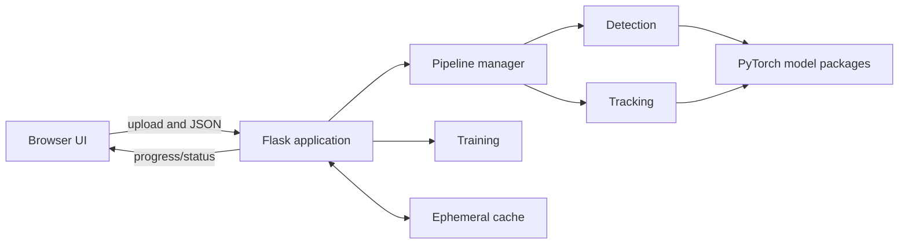

# RootDetector Technical Guide

This document is for developers, maintainers, release builders, and researchers who need implementation details. The shorter [README](README.md) is the user-facing installation and operation guide.

## System Overview

RootDetector is a local Flask application and command-line tool for analyzing minirhizotron images. It extends the shared `DigIT-Base-UI` Git submodule with root-specific detection, exclusion-mask, tracking, training, and export behavior.



`main.py` dispatches CLI operations or starts the browser application. At development startup, Jinja templates and frontend files are compiled into ignored `static/` output. Uploaded sources, intermediate arrays, images, JSON, CSV, and ZIP archives are written under `cache/`.

## Automated Analysis Pipeline

The primary browser workflow is now:

```text
select images -> validate and pair -> upload once -> detect each image
              -> track valid adjacent pairs -> review summary -> export
```

`backend/pipeline.py` owns in-process runs and exposes start, status, cancel, and retry operations. Inference remains sequential to protect memory, but workflow control is automatic. Each image or pair receives an explicit state such as `queued`, `detecting`, `tracking`, `completed`, `failed`, `skipped`, `review_required`, or `cancelled`.

A failed detection does not stop independent images. Pairs that depend on failed images are skipped with a structured reason and diagnostic ID. Retrying resets failed, skipped, or cancelled work while retaining successful results. Detection checks cancellation between inference patches. Tracking checks before and after each descriptor operation and after every 512-point matching batch; the status dialog exposes the current matching phase and progress. A single active PyTorch descriptor operation remains cooperative rather than forcibly pre-empted.

The browser controller in `frontend/roots/pipeline.js` uploads sources, creates a run, polls status, applies results to the existing Detection and Tracking interfaces, and presents a final summary. Run state is held in memory and is lost when the application restarts.

## Detection and Tracking Artifacts

Detection retains a soft root-probability array for tracking and separately creates the normal binary segmentation, skeleton, and statistics. Internal artifacts use the dependency-derived SHA-256 key:

```text
rootdetector-segmentation-<cache-key>.npy
rootdetector-segmentation-<cache-key>.png
rootdetector-segmentation-<cache-key>.json
rootdetector-exclusionmask-<cache-key>.*
```

The JSON manifest records the schema and operation versions, input name/hash/size, selected model or custom-mask hash, storage type, array shape, and hashes of the cached array and preview. A changed dependency or damaged artifact selects a new key or triggers recomputation. Detection and tracking therefore segment each compatible image once without silently reusing stale work.

Tracking groups filenames by sample and date, sorts each group chronologically, and constructs consecutive pairs. If no prefix occurs at two or more dates, the interface explicitly identifies the run as detection-only and shows the required naming pattern. `backend/tracking_matcher.py` uses the released model for descriptor extraction and owns a versioned, cancellable copy of the released 2022 brute-force algorithm. It matches points in 512-point batches, interpolates a deformation field, warps the first probability and exclusion masks into observation-2 coordinates, and creates RGB/RGBA turnover maps. The released `first` policy remains the default and uses only the warped exclusion mask from observation 1. This experimental branch also exposes `union`, `intersection`, and `second` policies for controlled scientific comparison; selecting one can change turnover counts. A pair with fewer than 16 automatic matches is marked for review; a pair exceeding the configured skeleton threshold is skipped rather than returned as a server error.

Tracking exports include cached segmentations, a growth map, matched-point/model/matcher metadata in JSON, pair CSV statistics, and combined `tracking_results.zip`. Pair metadata and the top-level manifest record matcher name/version/batch size, the exclusion policy, mask presence, source/combined pixel counts, and coordinate system. CSV output uses the declared same/decay/growth/background/mask column order and Python's CSV quoting. The default sampling mode is legacy version 1. Opt-in version 2 uses a local NumPy `RandomState` seeded from SHA-256 of ordered source images, soft segmentations, selected model identities, and sampling constants. The seed and its identity fields are included in the pair JSON and ZIP manifest. This fixes sampling variability but does not guarantee cross-device numerical identity; compare packaged CPU/GPU results and visually review matches before changing the default.

## Repository Layout

| Path | Purpose |
| --- | --- |
| `backend/` | Flask extension, pipeline, detection, tracking, evaluation, training, settings, and CLI |
| `frontend/roots/` | RootDetector-owned browser overrides and pipeline controller |
| `templates/roots/` | Root-specific toolbar, tabs, settings, and progress dialogs |
| `base/` | Pinned shared UI/service submodule; it should remain clean |
| `models/` | Download manifest and ignored runtime model files |
| `models_src/` | Source packaged into the legacy segmentation models |
| `tests/testcases/` | Fast orchestration/API/cache/CSV tests and real-model smoke test |
| `docker/core/` | Reproducible Python 3.7 CPU test/application image |
| `build.py` | PyInstaller release builder |
| `.github/workflows/build.yml` | Manually dispatched Windows binary build |

Do not edit generated `static/`. Root-specific changes that must be committed atomically belong in this repository rather than as an uncommitted change inside `base/`.

## Runtime and Model Distribution

The reference stack is Python 3.7 with PyTorch 1.10.1 and TorchVision 0.11.2. This legacy environment is not compatible with the host's current Python 3.14 installation, so Docker is the recommended local baseline.

`models/pretrained_models.txt` declares five downloads: WM and beech detection models, matching exclusion-mask models, and one tracking model. Each entry includes a SHA-256 checksum. Downloads stream to a temporary file, are verified, and are atomically installed. An existing corrupt model is replaced with a verified copy.

Application startup still fetches missing models. This is required for the downloadable Windows ZIP, which contains the manifest but not the large weights. Developers and CI should prefetch explicitly so startup is deterministic.

## Docker Development

```bash
git submodule update --init --recursive
docker compose -f compose.core.yml build
docker compose -f compose.core.yml run --rm model-fetch
docker compose -f compose.core.yml up app
```

Open `http://127.0.0.1:5000`. Run tests in another terminal:

```bash
docker compose -f compose.core.yml run --rm test-fast
docker compose -f compose.core.yml run --rm test-smoke
```

`test-fast` covers state transitions, retry, cancellation, training jobs, tracking matcher/provenance, request validation, download integrity, cache invalidation, and exports. `test-smoke` uses released models to check detection/tracking/export and matcher equivalence with the released package.

`node tests/testcases_js/test_upload_reliability_node.js` exercises browser-side error normalization and simulates a transport failure on image 71 of 86. It verifies the bounded retry and that the next attempt reuses the first 70 acknowledged uploads. `node tests/testcases_js/test_tracking_utils.js` verifies strict filename dates, consecutive temporal pairing, and rejection of same-day duplicates. The Windows build workflow runs both dependency-free Node checks before packaging.

The fast suite is suitable for every change; run the model-dependent smoke suite before proposing a release. Record test counts and timing with the relevant commit rather than relying on historical figures.

## Native Source Development

Where a compatible Python 3.7 environment is available:

```bash
git clone --recurse-submodules https://github.com/YohannesTesfay/Root-Detector.git
cd Root-Detector
python3.7 -m venv venv
source venv/bin/activate              # Linux/macOS
# venv\Scripts\activate             # Windows cmd.exe
python -m pip install 'pip<24.1'
pip install -r requirements.txt
python fetch_pretrained_models.py
python main.py
```

Missing models are also downloaded on startup, but explicit fetching gives clearer offline failures and verifies readiness before loading the UI.

The repository contains the `base/` UI as a Git submodule. A normal clone does not populate it unless `--recurse-submodules` is used (or `git submodule update --init --recursive` is run afterward). GitHub's automatically generated source ZIP therefore must not be presented to nontechnical users as a ready-to-run Windows application.

## Command-Line Workflows

Quote patterns so Python, not the shell, expands them.

```bash
# Detection
python main.py --process \
  --input 'images/sample_data/WM/*.tiff' \
  --output root-results.zip

# Evaluation
python main.py --evaluate \
  --predictions 'root-results.zip' \
  --annotations 'annotations/*.png' \
  --output evaluation.zip

# Segmentation-model training
python main.py --training \
  --input 'training/images/*.tiff' \
  --annotations 'training/annotations/*.png' \
  --model models/detection/2023-03-22_028a_WM.pt.zip \
  --epochs 10 --lr 0.0001 \
  --output retrained-model.pt.zip
```

Tracking remains browser-only. Browser/API training uses `training_type`, `epochs`, and `learning_rate`; the command-line option `--lr` and API field `lr` remain compatibility aliases. If both API names are supplied, their values must match. Browser training now selects only separately imported annotations, not detection outputs, and requires an explicit per-run confirmation that all selected labels were independently reviewed. Both `/api/training/runs` and legacy `/training` reject requests without `label_review: {"source":"user_reviewed","confirmed":true}`. The browser also sends `label_filenames`, one separately named PNG per source image, avoiding collisions with cached detection outputs; older clients may omit this field and use conventional annotation names. This is an auditable user assertion, not proof of label quality; imported results ZIPs are not automatically ground truth. CLI users remain responsible for supplying reviewed masks. Browser training starts an asynchronous run, polls progress, and can enter `queued`, `running`, `cancelling`, `completed`, `cancelled`, or `failed`. Only a completed run can be saved. Legacy released models are wrapped so swallowed runtime errors become failures, while newly built model sources return the state directly. A full released-model training run is still required on each supported CPU/GPU target before release.

CLI commands now return meaningful process exit codes: `0` for success, `1` for failure or invalid input, `2` when image processing produced partial results, and `130` for cancelled processing or training. Running `python main.py` without a CLI operation still starts the browser application.

Soft segmentation and exclusion-mask caches are content-addressed. Their sidecar manifests bind cached arrays to input hashes, model or custom-mask hashes, operation/schema versions, and artifact hashes. Modified or truncated artifacts are recomputed. Tracking ZIPs retain descriptive filenames and include `tracking-results-manifest.json`; schema 2 warns that older tracking CSVs may contain values under incorrect headers.

## HTTP Interface

| Endpoint | Purpose |
| --- | --- |
| `GET /api/session` | Return the random per-launch request token and upload limits |
| `POST /file_upload` | Store an uploaded file in the cache |
| `POST /api/pipeline/runs` | Validate sources/pairs and start a run |
| `GET /api/pipeline/runs/<id>` | Return progress, item states, errors, and results |
| `POST /api/pipeline/runs/<id>/cancel` | Request cooperative cancellation at the next safe checkpoint |
| `POST /api/pipeline/runs/<id>/retry` | Retry failed, skipped, and cancelled items |
| `POST /api/training/runs` | Validate inputs and start an asynchronous training run |
| `GET /api/training/runs/<id>` | Return training state, progress, result, or diagnostic error |
| `POST /api/training/runs/<id>/cancel` | Request cooperative training cancellation |
| `POST /process_image/<name>` | Run the legacy single-image detection path |
| `POST /process_root_tracking` | Run or manually correct one tracking pair |
| `POST /postprocess_detection/<name>` | Rebuild detection artifacts after threshold editing |
| `POST /compile_tracking_results` | Create the combined tracking ZIP |
| `POST /training` | Legacy blocking adapter backed by the same training job manager |
| `POST /stop_training` | Legacy cancellation adapter for the active training run |
| `POST /save_model` | Save a successfully completed training result |
| `GET/POST /settings` | Read or update model/runtime settings |
| `GET /stream` | Server-sent processing events |
| `GET /images/<path>` | Serve cache artifacts |

All `POST`, `PUT`, `PATCH`, and `DELETE` requests require the `X-RootDetector-Token` returned by `/api/session`. The browser installs this header automatically. The server rejects cross-origin requests, unexpected hostnames, and legacy mutation-by-`GET` calls. It also validates request-controlled filenames and decoded image content before processing.

The service is still a single-user desktop application, not a remote or multi-user service. Ordinary launches are restricted to `localhost`, `127.0.0.1`, or `::1`; do not expose it publicly. Docker sets `ROOTDETECTOR_ALLOW_CONTAINER_BIND=1` only so Flask can listen inside the container, while Compose publishes port 5000 exclusively on host loopback.

Upload limits are 16 files per request, 256 MiB per request/file, 240 UTF-8 filename bytes, and 200 million decoded pixels per image. Accepted encodings are PNG, JPEG, and TIFF/TIF. An identical re-upload is reused; a different file with the same basename returns HTTP `409` rather than overwriting cached data.

Responses include content-type, referrer, frame, permissions, and Content Security Policy headers. The CSP is transitional: legacy templates still require inline script/style and `eval`, which must be removed before those allowances can be dropped.

## Windows Package Behavior

The upstream 2023 Windows-binaries ZIP is a PyInstaller distribution. It used `main.bat`, `main/main.exe`, and `models/pretrained_models.txt`; it did not contain `main.py`.

The release builder produces the same directory-bundle/full-ZIP format but writes **only `StartRootDetector.bat`** as the launcher. `BUILD-INFO.txt` identifies the source commit and Actions run. Existing older packages are unaffected; scripts that invoke `main.bat` must use the new launcher with a new package.

Runtime diagnostics are written to `logs/rootdetector.log` beside the portable application and rotated at 5 MiB with three backups. `GET /api/diagnostics` produces a support ZIP containing those logs, `BUILD-INFO.txt`, and a privacy-limited system snapshot. It excludes input images, results, and environment variables; logs can contain research filenames and technical paths and should be reviewed before sharing. Pipeline error IDs correlate the browser message with log entries.

Browser-only failures can be reported to `POST /api/diagnostics/client`; fields are length-bounded, normalized to one line, and written with a correlation ID. Result-image downloads retry only interrupted, timeout, rate-limit, and server-error responses. Permanent client errors such as HTTP 404 fail immediately. In portable builds, `torch.__version__` can retain a `+cpu` label even after first-launch replacement libraries make CUDA available, so diagnostics report the effective inference device and CUDA availability separately from package metadata.

The launcher:

1. Changes the working directory to the extracted package, including paths containing spaces.
2. sets `ROOT_PATH` to that directory;
3. starts `main\main.exe`;
4. leaves the console open so first-run progress and errors remain visible.

When `--prune-torchlibs` is used, the first launch downloads the required Windows PyTorch libraries. The application then downloads and verifies missing model packages, loads the configured models, starts Flask, and opens the default browser. Therefore the end-user launch pattern remains effectively the same; users should double-click the BAT launcher, not the source `main.py`.

The legacy PyTorch-library downloader does not yet have the model downloader's checksum/atomic-install hardening. Signed installers, offline bundles, and modern dependency packaging remain part of the larger improvement plan.

## Windows Release Workflow

Pushing source does not replace a Windows download. The **Build Windows Binaries** workflow is manually dispatched for a selected branch or tag and publishes one full `RootDetector-Windows-portable` artifact. It fetches and verifies model weights before packaging. The older PDF's `main.bat` instruction applies only to historical downloads; new full ZIPs contain `StartRootDetector.bat` and `main\main.exe`.

1. Open a PR against the fork's `main`, run both Docker suites, and dispatch the Windows build on that PR branch.
2. Verify the ZIP hash and `BUILD-INFO.txt`, extract into a fresh folder, then test launch, first-run downloads, detection, tracking, export, restart, and paths with spaces.
3. Qualify release-sensitive GPU behavior on the packaged Windows build. Record its evidence and remaining gates in the fork PR; historical acceptance notes are kept locally and in Git history.
4. After review and merge, build the exact fork `main` head intended for release. Publish its tested full ZIP and SHA-256 on a GitHub Release; workflow artifacts are temporary, not public releases.

PyInstaller cannot cross-build the Windows package from macOS or Linux. A new package also changes the launcher name, so existing scripts calling `main.bat` require an explicit update.

## Build Commands

On Windows with the legacy dependencies installed:

```powershell
python fetch_pretrained_models.py
python build.py --zip --prune-torchlibs
```

Artifacts are written under `builds/`. The full ZIP is the package for new users. The builder retains a smaller legacy `.update.zip` for compatible existing installations, but the workflow does not publish it because it lacks standalone dependencies, compatibility checks, and rollback.

## Fork Workflow

`origin` should point to `YohannesTesfay/Root-Detector`; `upstream` should fetch from `ExPlEcoGreifswald/RootDetector` and remain push-disabled.

```bash
git fetch upstream
git switch main
git merge --ff-only upstream/main
git push origin main
git switch -c feature/my-change
```

Keep commits focused and explicitly mention changes to the model manifest, generated release behavior, or the `base/` submodule pointer. See [AGENTS.md](AGENTS.md) for contributor conventions.

## Known Constraints and Next Work

- Python 3.7, PyTorch 1.10, Flask 2.0, PyInstaller 5.1, and the runtime download approach are legacy.
- Cache contents and automated run state are temporary and not resumable after restart.
- Inference is sequential and progress between model operations is more precise than progress inside an operation.
- Filename-based pairing requires supported dates and cannot yet be edited through a dedicated pairing interface.
- Browser training uses `learning_rate`; the backend also accepts the legacy `lr` compatibility alias.
- The application is a trusted local desktop service, not a hardened multi-user server.
- Signed Windows installation, macOS/Linux distributables, accessibility, and dependency modernization remain open roadmap work.

See [IMPROVEMENT-PLAN.md](IMPROVEMENT-PLAN.md) for the active technical and interface roadmap. The completed core-automation plan remains available in Git history rather than the current documentation set.
